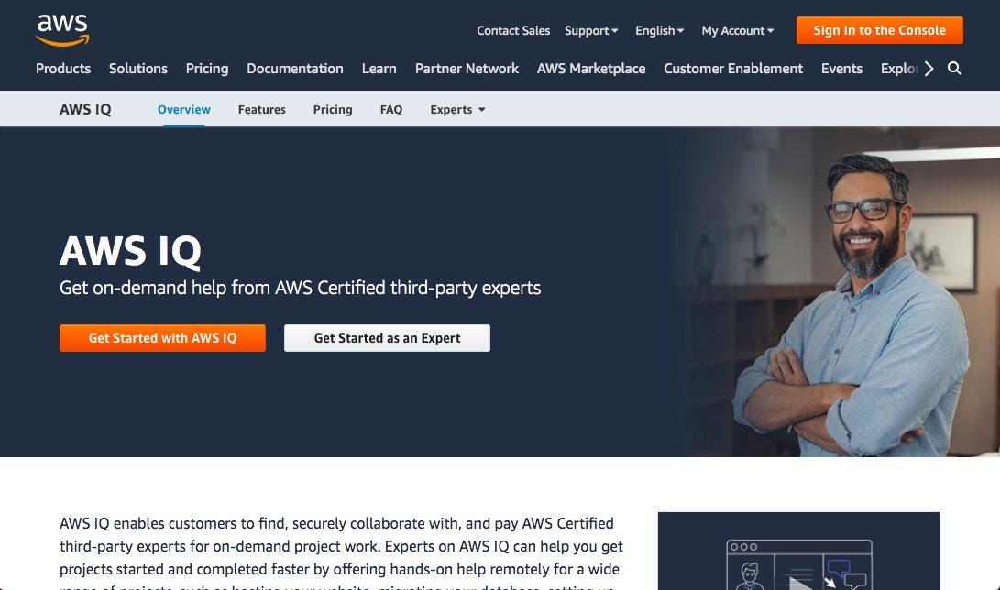
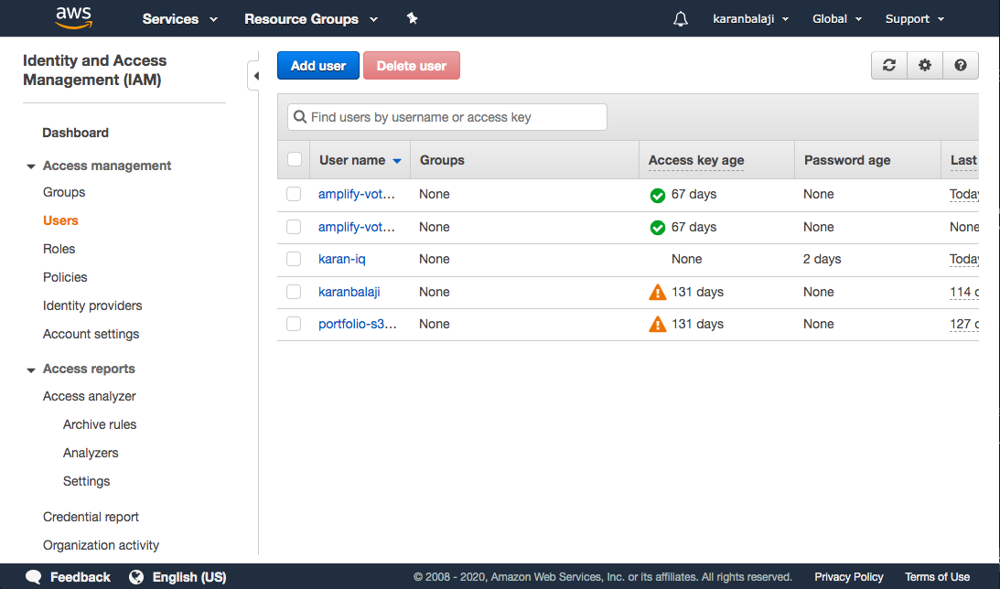
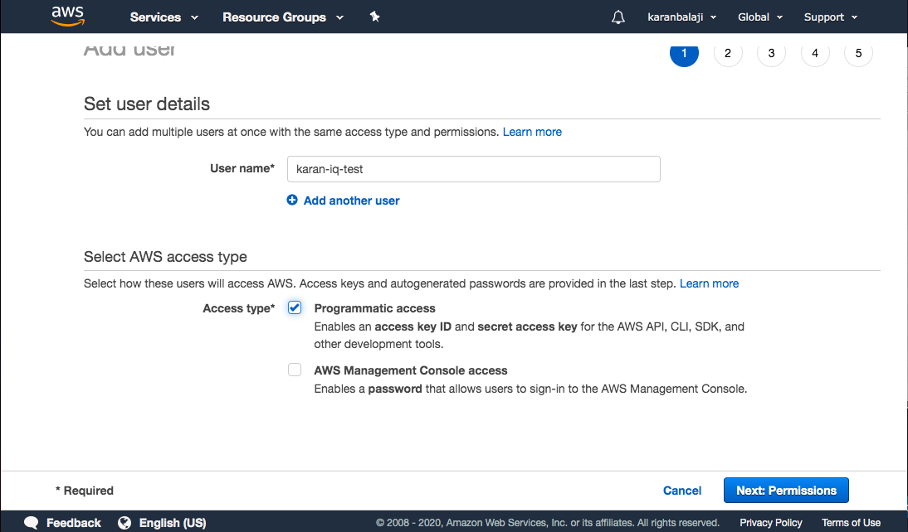
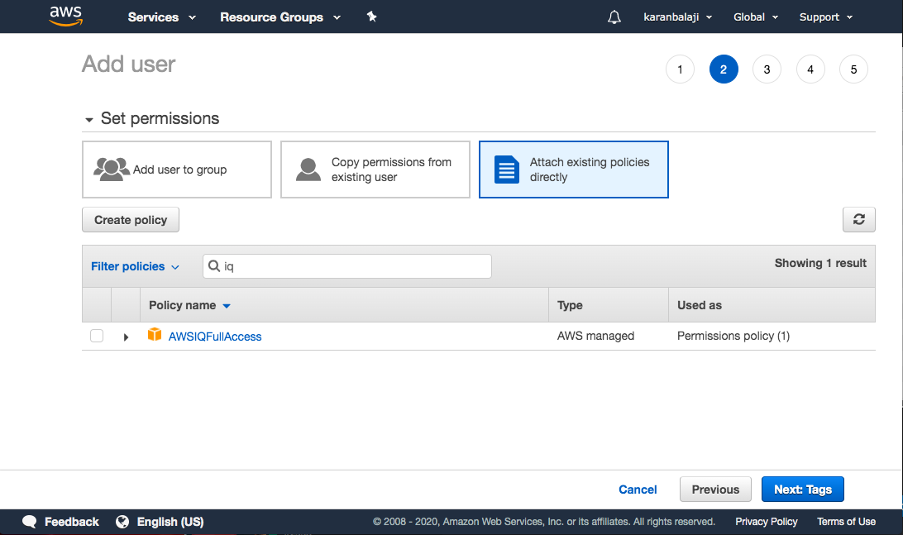
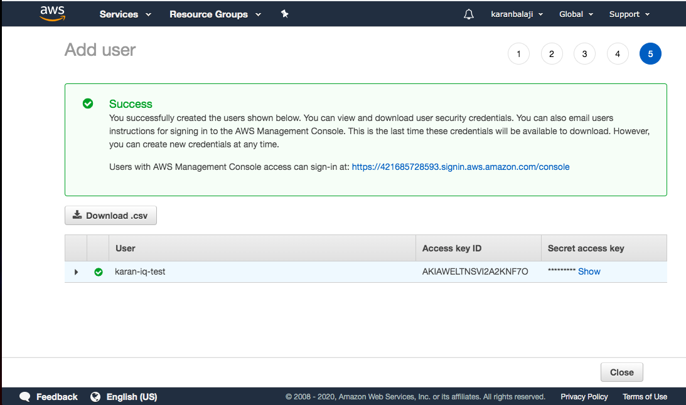
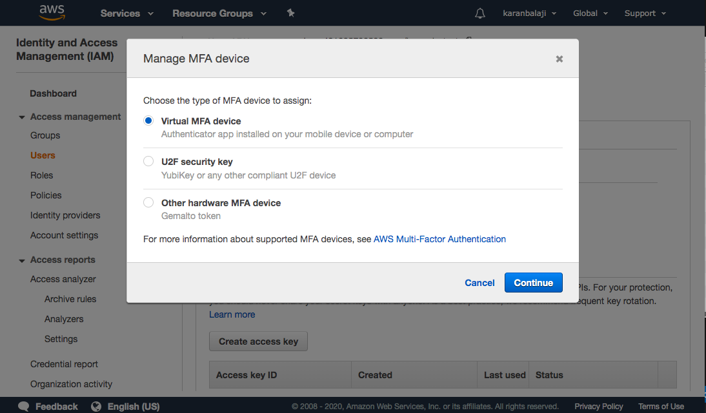
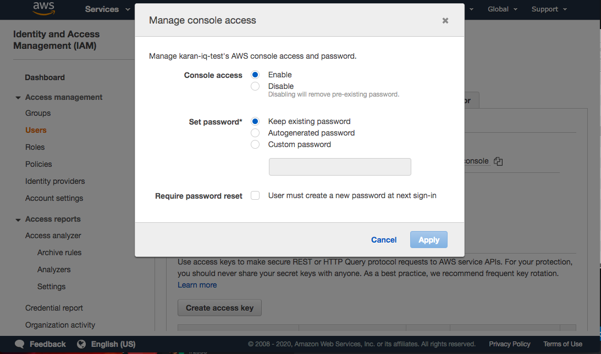

# How to create IAM user with seperate login, MFA and introduction to AWS IQ access. 

## Introduction

✍️ I choose to do this as my first project because not a lot of people are aware of AWS IQ and setting up a consultant acccount was tricky.

## Prerequisite

✍️ Familiarity with the AWS Console/Platform

## Cloud Research

- ✍️ In order to use AWS IQ we needed to create a seprate account with MFA other than the Root account. AWS IQ enables customers to find, securely collaborate with, and pay AWS Certified third-party experts for on-demand project work.

## Try yourself

### Step 1 — Navigate to IAM user from the search. Click on users on the left navigation panel and select add user.
- 

### Step 2 — Create a user name and tick ✅ programmatic access
- 

### Step 3 - Select attach existing policy and type **iq** in the search box and select AWSIQFullAccess.
- 
- ✍️ You can assign a tag or leave it empty.

### Step 4 - Congratulations, you have created a user with least privilege. After this screen, close it and go back to the IAM dashboard.
- 

### Step 5 - Select the user and navigate to the security credential tab and then select manage assigned MFA
- 
    
### Step 6 - Select Virtual MFA 
- 

### Step 7 - Download any app that is suggested and enter the MFA codes
- 

### Step 8 - Close it and then Select manage from the console password and assign a password
- 

### Step 9 - Nagivate through the link and then you can login as your test account
- 

## ☁️ Cloud Outcome

✍️ (Result) Setting up MFA was tricky cause i had to use different mobile apps. The one i used was AUTHY. 

## Next Steps

✍️ Up next I would try to do something similar in Azure cloud.

## Social Proof

✍️ [LinkedIn](link)
✍️ [Twitter](link)

