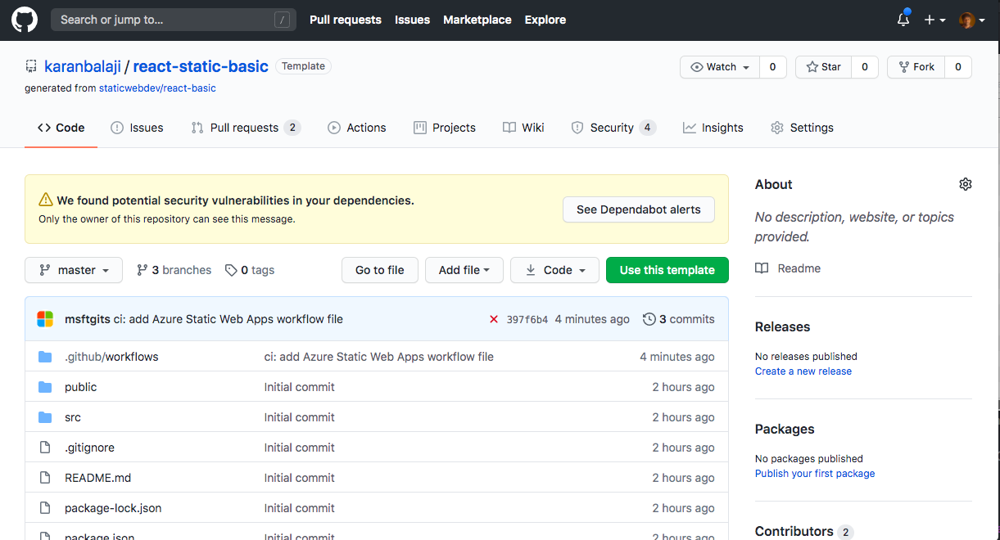
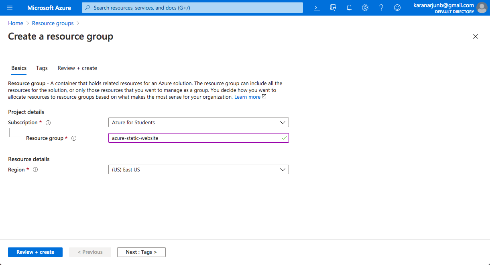
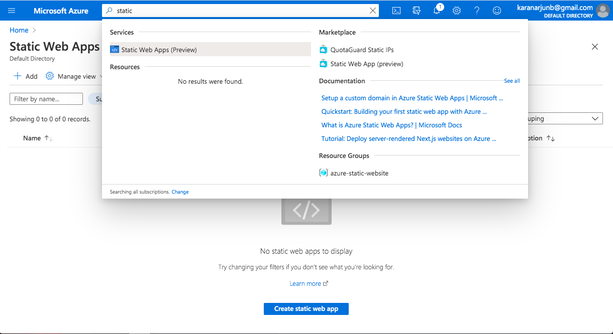
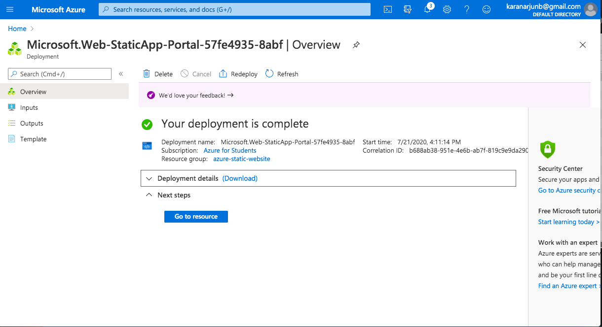
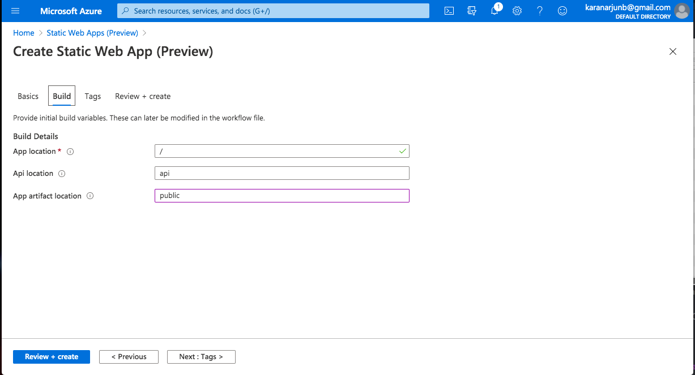
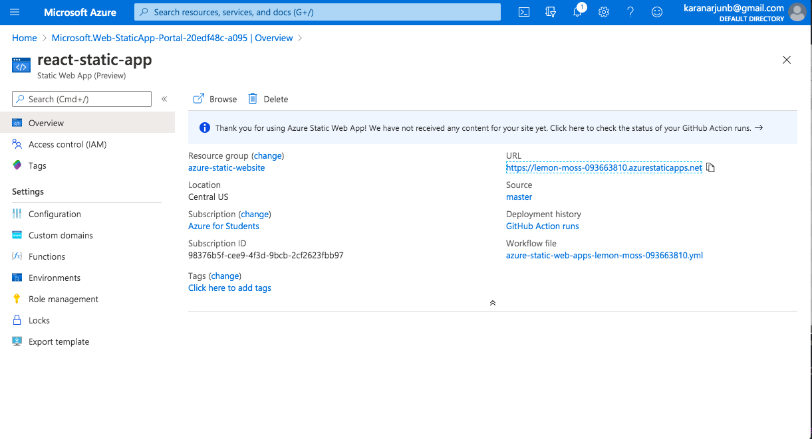

# How to create a React Static Webapp hosted on Azure and managed on Github.

## Introduction

A beginner level project with azure that helped me get used to its User Interface(Has Dark Mode) which is great compared to AWS. I choosed to do this because it helped me understand the basics of static web hosting.

## Prerequisite

Familiarity with the Azure Portal

## Cloud Research

- I like that Azure and Github goes well together than AWS. Lot of beginner users are already familiar with Github than AWS CodeCommit. On Github We can also immediatly template a project or fork it quickly. This seemed to be very useful when it comes to building quick landing pages on Azure than AWS.

## Try yourself

### Step 1 — Create a GitHub account and click the "Use This Template" button.
- 
- Give the repository a name for exampe react-static-basic

### Step 2 — In Azure portal Search for resource groups and create one with a name of your choice.
- 

### Step 3 - Search for static web apps and select the service.
- 

### Step 4 - Fill the required details and connect your github with repo of the master branch
- 
- You can find your repository which we created and select master branch

### Step 5 - Under build tab type public under "App artifact location" and then proceed to create.
- 
    
### Step 6 - Select Go to resources after the project is deployed 
- 

### Step 7 - Congratulations, you can now view your website under the URL after giving it time to load.
- 

## ☁️ Cloud Outcome

I found resource groups a bit newSetting up static websites on Azure was pretty quick which is helpful when you deal with SME clients who are going digital and require landing pages.

## Next Steps

Up next I would try to do something similar in Azure cloud.

## Social Proof

[LinkedIn](https://www.linkedin.com/posts/karanbalaji_karanbalaji100daysofcloud-activity-6691067063806623744-LOGw)
[Twitter](https://twitter.com/Karanbalaji047/status/1285299628594921473)

