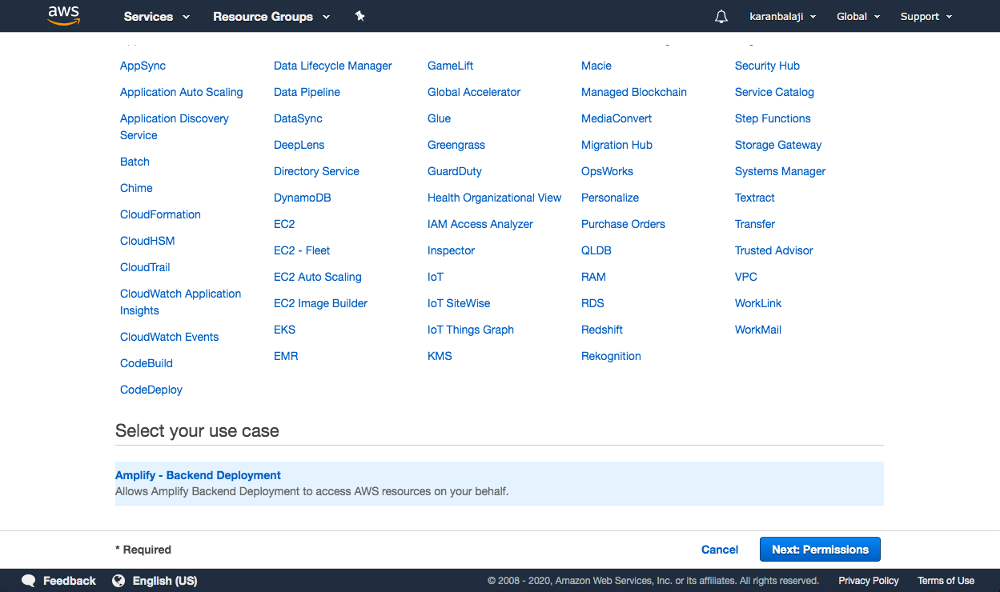

# Deploying a Gatsby React full stack webapp with AUTH using AWS Amplify.

## Introduction

A beginner level project that explaings how to deploy a basic react full stack stack auth app from Github with Amplify.  

## Prerequisite

Familiarity with the AWS portal, IAM, Github.

## Cloud Research

- A treat for Front-end developers because AWS Amplify is the fastest way to build and deploy web and mobile apps. It has lot of tools and open source use case centric libraries that can be used to quickly implement features.

## Try yourself

### Step 1 — Scroll down and select the deploy to amplify console.
#### Link to the Repo https://github.com/karanbalaji/gatsby-auth-starter-aws-amplify

### Step 2 — Select creat a role which will open a new window

### Step 3 - Select next button as the use case is pre-selected

### Step 4 - Give admin access policy to this role and selct next

- You can find your repository which we created and select master branch

### Step 5 - Create the role and go back to the Amplify window

    
### Step 6 - Attach the role and click on "save and deloy" 

### Step 7 - Click continue and wait for the site to deploy

### Step 7 - Click here to preview the website once it is ready.

## ☁️ Cloud Outcome

I found that Setting up Webapp on AWS amplify was much faster and easier than Azure because of its starter templates available on gatsby. Creating role and a policy is the only extra step to creating #AWSome full stack app. 

## Next Steps

I would add more features and implement more AWS related things to this full stack app.

## Social Proof

[LinkedIn](https://www.linkedin.com/posts/karanbalaji_karanbalaji100daysofcloud-activity-6691067063806623744-LOGw)
[Twitter](https://twitter.com/Karanbalaji047/status/1285702213357178885)

