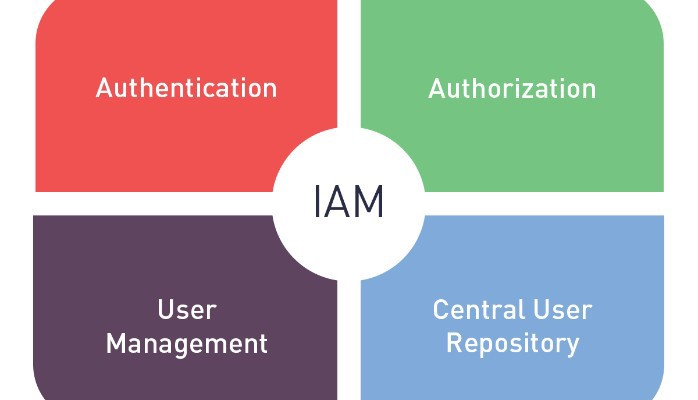
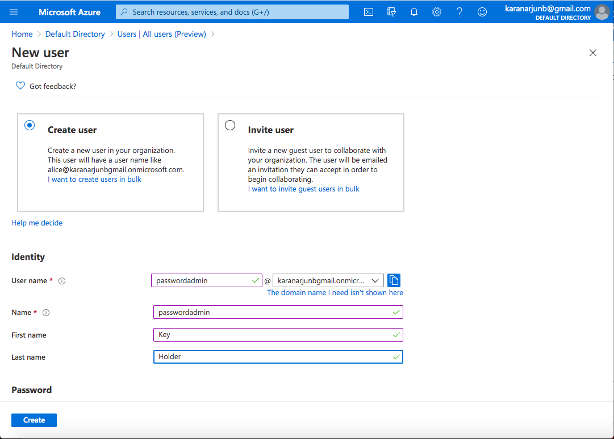
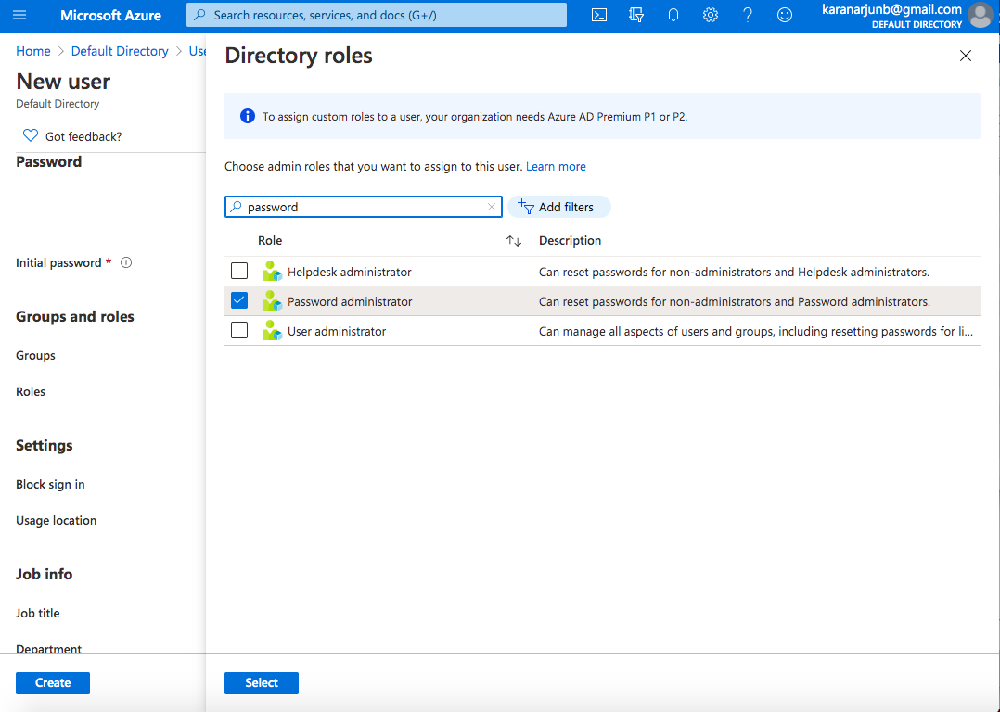
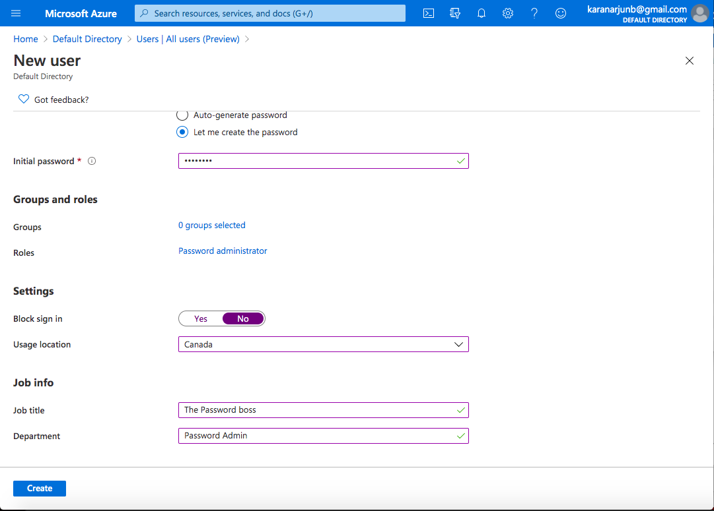

# Access Management using Azure Active directory to creat user who manages password resets.

## Introduction

A beginner level exercise that helps setup a user with least privilege a role that maintains password reset in the organization 

## Prerequisite

Familiarity with the Azure portal and Azure Active Directory.

## Cloud Research

- Azure Active Directory is like AWS (IAM). The UI of Azure is great.

## Try yourself

### Step 1 — Search for Active Directory and create the respective user name etc.

### Step 2 — Scroll down and select roles and type password administrator in search to attach the role

### Step 3 - Set usage location and optionally you can create groups for best practices 

## ☁️ Cloud Outcome

Azure UI is really good and simple. After using for AWS for so long i feel i can learn azure faster.

## Next Steps

Aiming to get Azure fundamentals.

## Social Proof

[LinkedIn](https://www.linkedin.com/posts/karanbalaji_100daysofcloud-azure-aws-activity-6692245205615202304-ojQm)
[Twitter](https://twitter.com/Karanbalaji047/status/1286478832027959298)

