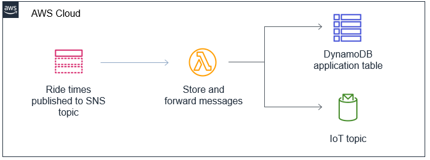

# Module 2 - Real-time ride wait times with SNS, Lambda, IoT & DynamoDB

## Prerequisite

This is a follow along workshop and reqires sound AWS knowledge with at least cloud practioner.

## Project Link Outcome - https://master.d3ja7u40klmv5g.amplifyapp.com/#/

## Github Follow Along Link - https://github.com/aws-samples/aws-serverless-workshop-innovator-island/blob/master/2-realtime/README.md

## Social Proof

[LinkedIn](https://www.linkedin.com/posts/karanbalaji_100daysofcloud-cloud-aws-activity-6693135851876081664-exxN)
[Twitter](https://twitter.com/Karanbalaji047/status/1287370554606063619)

