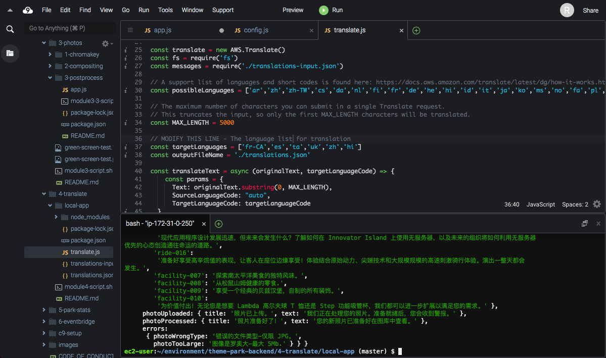

# Module 4: Language translation for Canadian personas 🇨🇦

## Prerequisite

This is a follow along workshop and reqires sound AWS knowledge with at least cloud practioner.

## Personalization
AWS translate has list of languages to be used for personalization. I have included some top commonly spoken languges in Canada🇨🇦 and hope to see if i could target this part of the project based on Geo location using cloud front or a lambda edge. 
### Language Selection link: https://docs.aws.amazon.com/translate/latest/dg/what-is.html#what-is-languages

## Project Link Outcome - https://master.d3ja7u40klmv5g.amplifyapp.com/#/

## Github Follow Along Link - https://github.com/aws-samples/aws-serverless-workshop-innovator-island/blob/master/4-translate/README.md
-

## Social Proof

[LinkedIn](https://www.linkedin.com/posts/karanbalaji_100daysofcloud-aws-cloud-activity-6694471398259245056-YxeV)
[Twitter](https://twitter.com/Karanbalaji047/status/1288314499624296450)

