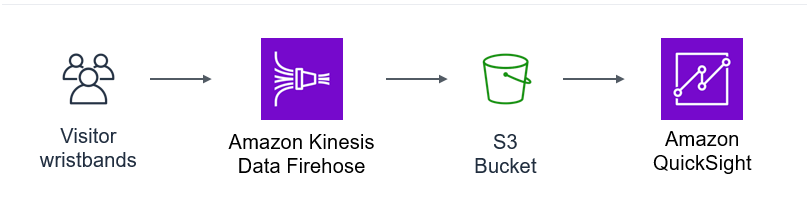

# Module 5: Analyzing visitor with AWS kinesis and Quicksight

## Prerequisite

This is a follow along workshop and reqires sound AWS knowledge with at least cloud practioner.

## Project Link Outcome  - https://master.d3ja7u40klmv5g.amplifyapp.com/#/

## Github Follow Along Link - 
- https://github.com/aws-samples/aws-serverless-workshop-innovator-island/tree/master/5-park-stats

## Social Proof

[LinkedIn](https://www.linkedin.com/posts/karanbalaji_karanbalaji100daysofcloud-activity-6695153956240322561-0H_H)
[Twitter]()

