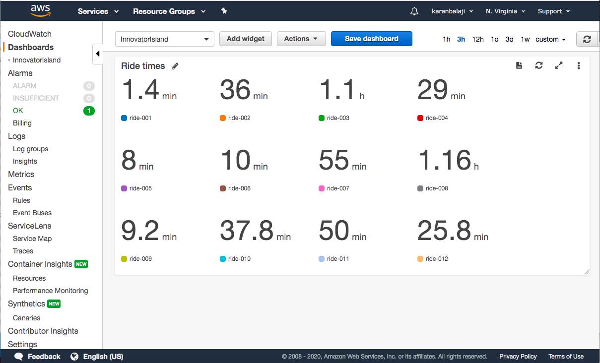

# Module 6A: Developing event-based architecture - (1) Configure the event bus and metrics dashboard

## Prerequisite

This is a follow along workshop and reqires sound AWS knowledge with at least cloud practioner certification.

## Project Link Outcome  - https://master.d3ja7u40klmv5g.amplifyapp.com/#/

## Github Follow Along Link - 
- https://github.com/aws-samples/aws-serverless-workshop-innovator-island/blob/master/6-eventbridge/1-eventbus/README.md

## Social Proof

[LinkedIn](https://www.linkedin.com/posts/karanbalaji_100daysofcloud-aws-cloud-activity-6696593706214047744-r2X6)
[Twitter](https://twitter.com/Karanbalaji047/status/1290827916272701440)

